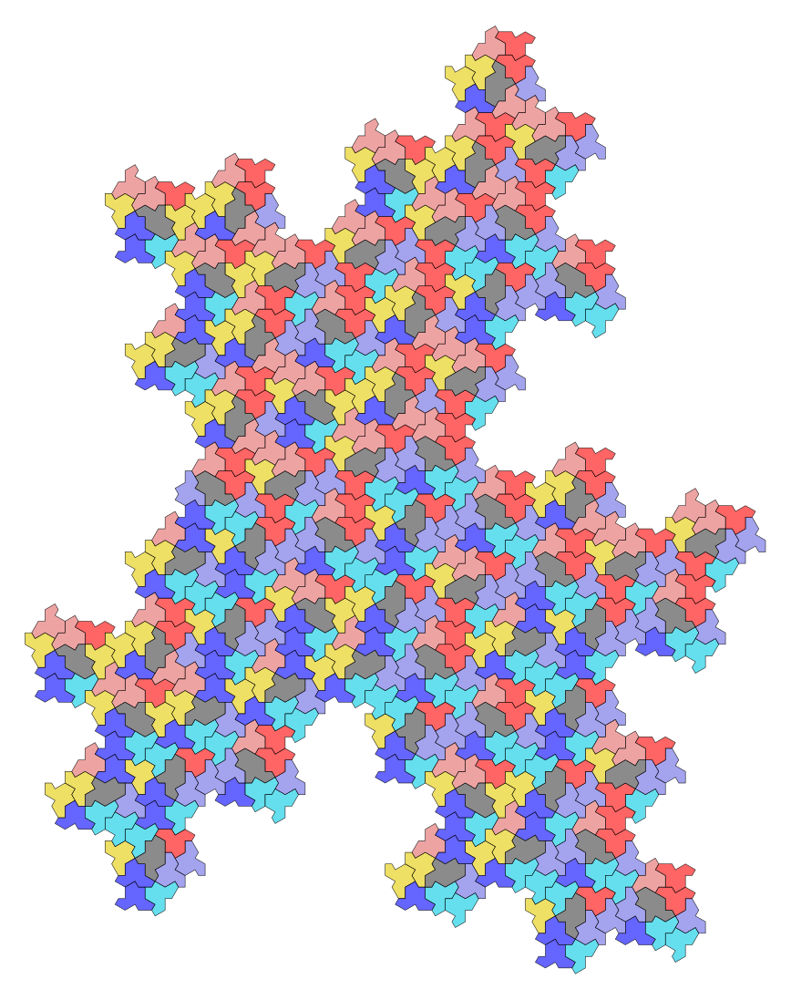

Python script for generating tilings of the weakly chiral aperiodic monotile Tile(1,1) "Spectre".

Code ported from JavaScript from the web app [1] provided [2] by the authors of the original research paper [3].

[1]: https://cs.uwaterloo.ca/~csk/spectre/app.html

[2]: https://cs.uwaterloo.ca/~csk/spectre/

[3]: https://arxiv.org/abs/2305.17743

*CHANGES
    * Made it possible to compare the drawing speed between the path drawing process of all polygons by mathplotlib and the two polygon reference processes via transform by drowsvg.
    * Made it possible to draw spectre tile(edge_a, edgeb) at any ratio.
       
